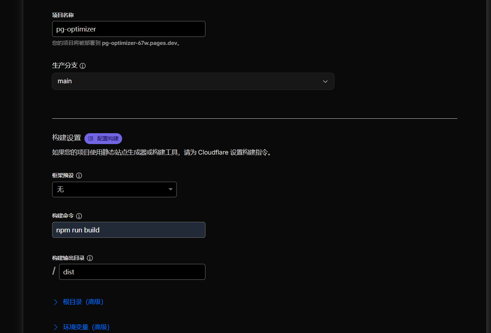

# PostgreSQL 性能参数优化工具

一个基于 Vue 3 的 PostgreSQL 性能参数自动优化工具，根据服务器配置（CPU核心数、内存大小、存储类型）自动生成优化的 PostgreSQL 配置参数。

## 📸 系统运行截图

### 主界面

*输入服务器配置信息（PostgreSQL版本、CPU核心数、内存大小、存储类型）*

### 生成的配置参数

*自动生成的优化参数，按类别分组显示，包含参数值、是否需要重启、参数描述等信息*

### 功能演示

*支持一键复制配置、生成并预览 ALTER SYSTEM SQL 等功能*

> **注意**: 如果 `screenshots` 目录不存在，请创建该目录并添加相应的截图文件。

## ✨ 功能特性

- 🎯 **智能参数计算**: 根据服务器配置自动计算优化的 PostgreSQL 参数
- 📊 **多版本支持**: 支持 PostgreSQL 13/14/15/16 版本
- 💾 **存储类型优化**: 支持 SSD 和机械硬盘两种存储类型，自动调整 I/O 相关参数
- 📋 **一键复制**: 支持复制配置文本
- 🔍 **SQL 预览**: 生成并预览 ALTER SYSTEM SQL 语句，支持在弹窗中查看和复制
- 📖 **参数说明**: 每个参数都有详细说明和官方文档链接
- 🔄 **重启提示**: 明确标识哪些参数需要重启服务才能生效
- 🎨 **现代化 UI**: 响应式设计，支持分组显示和参数编辑

## 🛠️ 技术栈

- **Vue 3** (Composition API)
- **Vite** (构建工具)
- **原生 CSS** (样式)

## 🚀 一键部署

### Cloudflare

> **注意**: Cloudflare 现已统一 Pages 和 Workers 平台，可以通过统一的界面部署静态网站和边缘应用。

[](https://dash.cloudflare.com/?to=/:account/workers-and-pages/create/pages)

**使用 Cloudflare 部署：**

#### 1. Fork 本仓库

将此项目 Fork 到你自己的 GitHub 账户下。

#### 2. 创建 Cloudflare Pages 项目

* 登录 Cloudflare 控制台，进入 `Workers & Pages`。
* 选择“创建应用程式” -> “Pages” -> “连结到 Git”。
* 选择你刚刚 Fork 的仓库。
* 在 **“设定组建和部署”** 页面，构建设定如下:
  * **框架预设**: `None`
  * **构建命令**: `npm run build`
  * **构建输出目录**: `/`



## 📦 本地安装和运行

### 安装依赖

```bash
npm install
```

### 开发模式

```bash
npm run dev
```

应用将在 `http://localhost:3000` 启动（支持通过 IP 地址访问）

### 构建生产版本

```bash
npm run build
```

### 预览生产构建

```bash
npm run preview
```

## 📖 使用方法

1. 选择 PostgreSQL 版本（当前支持 13）
2. 输入 CPU 核心数（例如：8）
3. 输入内存大小（GB，例如：32）
4. 选择存储类型（SSD 或机械硬盘）
5. 点击"生成配置"按钮
6. 查看生成的参数配置（可按分组查看）
7. 可以编辑参数值（双击参数值进行编辑）
8. 点击"复制配置"按钮复制配置文本
9. 点击"生成并预览 ALTER SYSTEM SQL"按钮在弹窗中查看和复制 SQL 语句

## 🔢 参数算法说明

工具根据以下算法自动计算 PostgreSQL 性能参数。所有内存相关的计算都基于用户输入的内存大小（GB）转换为字节进行计算。

### 基础计算

- **DBInstanceClassMemory** = 内存(GB) × 1024 × 1024 × 1024（转换为字节）
- **memoryMB** = 内存(GB) × 1024（转换为MB）

### 核心性能参数

#### 1. max_connections（最大连接数）
```
max_connections = CPU核心数 × 200
```
**说明**: 根据 CPU 核心数动态调整，确保有足够的连接数支持并发访问。

#### 2. shared_buffers（共享缓冲区）
```
shared_buffers = DBInstanceClassMemory / 4
```
**说明**: 设置为内存的 1/4，这是 PostgreSQL 最重要的性能参数之一，用于缓存数据页。

#### 3. effective_cache_size（有效缓存大小）
```
effective_cache_size = DBInstanceClassMemory / 16384
结果单位: 8kB
转换为字节: 结果 × 8 × 1024
```
**说明**: 用于查询规划器估算可用缓存，影响查询计划选择。例如 32GB 内存计算结果为 16GB。

#### 4. work_mem（工作内存）
```
work_mem = GREATEST(DBInstanceClassMemory / 4194304, 4096)
结果单位: KB
```
**说明**: 每个查询操作（排序、哈希、合并连接等）使用的内存大小。例如 32GB 内存计算结果为 8192KB。

#### 5. maintenance_work_mem（维护工作内存）
```
maintenance_work_mem = LEAST(DBInstanceClassMemory / 65536, 4194304)
结果单位: KB
```
**说明**: 维护操作（如 VACUUM、CREATE INDEX）使用的内存。例如 32GB 内存计算结果为 524288KB。

#### 6. wal_buffers（WAL 缓冲区）
```
wal_buffers = min(2047MB, shared_buffers / 32)
```
**说明**: WAL 缓冲区大小，用于缓存 WAL 数据。例如 shared_buffers 是 16GB，则 wal_buffers = min(2047MB, 512MB) = 512MB。

#### 7. min_wal_size（最小 WAL 大小）
```
min_wal_size = LEAST(GREATEST(DBInstanceClassMemory / 8388608, 256), 8192)
结果单位: MB
```
**说明**: WAL 文件不会缩小到此值以下。例如 32GB 内存计算结果为 4096MB。

#### 8. max_wal_size（最大 WAL 大小）
```
max_wal_size = LEAST(GREATEST(DBInstanceClassMemory / 2097152, 2048), 16384)
结果单位: MB
```
**说明**: 当 WAL 大小超过此值时，会强制触发检查点。例如 32GB 内存计算结果为 16384MB。

#### 9. temp_file_limit（临时文件限制）
```
temp_file_limit = DBInstanceClassMemory / 1024
结果单位: KB
```
**说明**: 限制单个会话可以使用的临时文件大小。例如 32GB 内存计算结果为 33554432KB。

### 并行处理参数

#### 10. max_worker_processes（最大工作进程数）
```
max_worker_processes = CPU核心数 × 2
```
**说明**: 限制后台工作进程的总数。

#### 11. max_parallel_workers_per_gather（每个 Gather 节点的最大并行工作进程数）
```
max_parallel_workers_per_gather = GREATEST(CPU核心数 / 2, 2)
```
**说明**: 控制单个查询的并行度。

#### 12. max_parallel_workers（最大并行工作进程数）
```
max_parallel_workers = GREATEST(CPU核心数 × 3 / 4, 8)
```
**说明**: 限制所有并行查询的总工作进程数。

#### 13. max_parallel_maintenance_workers（最大并行维护工作进程数）
```
max_parallel_maintenance_workers = GREATEST(CPU核心数 / 2, 2)
```
**说明**: 用于 CREATE INDEX、VACUUM 等维护操作的并行执行。

### 自动清理参数

#### 14. autovacuum_max_workers（最大自动清理工作进程数）
```
autovacuum_max_workers = LEAST(GREATEST(DBInstanceClassMemory / 17179869184, 3), 10)
```
**说明**: 17179869184 = 16GB，根据内存大小动态调整，范围在 3-10 之间。

#### 15. autovacuum_work_mem（自动清理工作内存）
```
autovacuum_work_mem = GREATEST(DBInstanceClassMemory / 65536, 131072)
结果单位: KB
```
**说明**: 每个自动清理工作进程使用的内存大小，用于存储死元组 ID，最大有效值为 1GB。

### I/O 相关参数（根据存储类型）

#### 16. random_page_cost（随机页面读取成本）
- **SSD**: `1.1`
- **HDD**: `4.0`

**说明**: 用于查询规划器估算随机 I/O 的成本。SSD 的随机读取性能接近顺序读取，因此成本较低。

#### 17. effective_io_concurrency（有效并发 I/O 操作数）
- **SSD**: `200`
- **HDD**: `4`

**说明**: 用于查询规划器估算并发 I/O 能力。SSD 支持更高的并发 I/O。

### 其他固定参数

- **checkpoint_timeout**: `15min` - 检查点超时时间
- **checkpoint_completion_target**: `0.9` - 检查点完成目标
- **bgwriter_lru_multiplier**: `2` - 后台写入器的 LRU 乘数
- **wal_compression**: `on` - 启用 WAL 压缩
- **jit**: `off` - 关闭 JIT 编译（可根据需要调整）

### 智能单位选择

工具会自动选择最合适的单位（GB、MB、KB）来显示内存相关的参数值：
- 如果能表示为整数 GB，则使用 GB
- 如果能表示为整数 MB，则使用 MB
- 否则使用 KB

例如：
- `shared_buffers`: 8GB（8GB 内存时）
- `wal_buffers`: 512MB（32GB 内存时）
- `work_mem`: 8192KB（32GB 内存时）

## 📝 参数分组

生成的参数按以下类别分组：

1. **性能相关参数**: 核心性能参数，如 shared_buffers、work_mem、并行处理参数等
2. **自动清理相关配置**: autovacuum 和 vacuum 相关参数
3. **超时相关**: 连接和语句超时参数
4. **日志记录相关**: 日志配置参数
5. **其他参数**: 其他优化参数

## 🔄 参数重启要求

工具会明确标识哪些参数需要重启 PostgreSQL 服务才能生效：

- **需要重启的参数**: shared_buffers、max_connections、max_worker_processes、wal_level、shared_preload_libraries、jit 等
- **可通过 pg_reload_conf() 生效的参数**: 大部分参数都可以通过 `SELECT pg_reload_conf();` 生效，无需重启

## 📚 参数说明

每个参数都包含：
- **详细说明**: 参数的作用和用途
- **官方文档链接**: 点击参数名旁边的链接图标可查看 PostgreSQL 官方文档
- **悬停提示**: 鼠标悬停在"?"图标上可查看参数说明

## 🎯 使用建议

1. **首次使用**: 建议先在测试环境验证生成的参数
2. **参数调整**: 可以根据实际业务需求手动调整参数值
3. **重启参数**: 修改需要重启的参数后，需要重启 PostgreSQL 服务
4. **监控调整**: 使用生成的参数后，建议监控数据库性能，根据实际情况调整

## 📄 许可证

MIT License

## 🤝 贡献

欢迎提交 Issue 和 Pull Request！

## 🌐 在线演示

项目已部署到 Cloudflare Pages，访问：[在线演示](https://your-project.pages.dev)

> 注意：请将 `your-project.pages.dev` 替换为你的实际部署地址

## 📞 联系方式

如有问题或建议，请提交 Issue。
