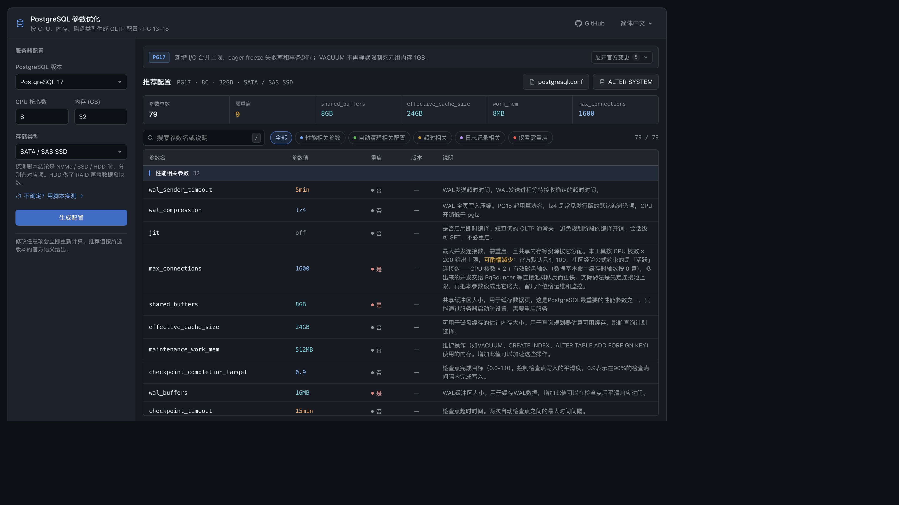
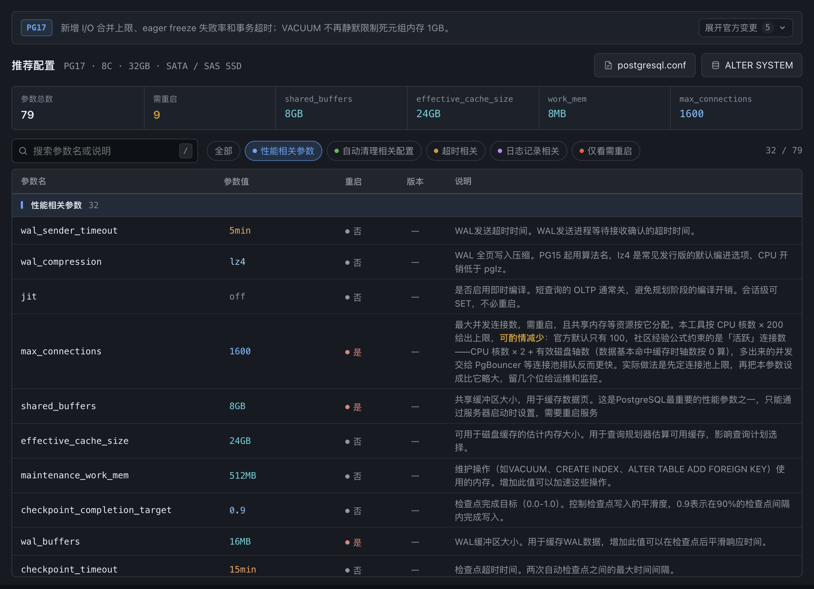
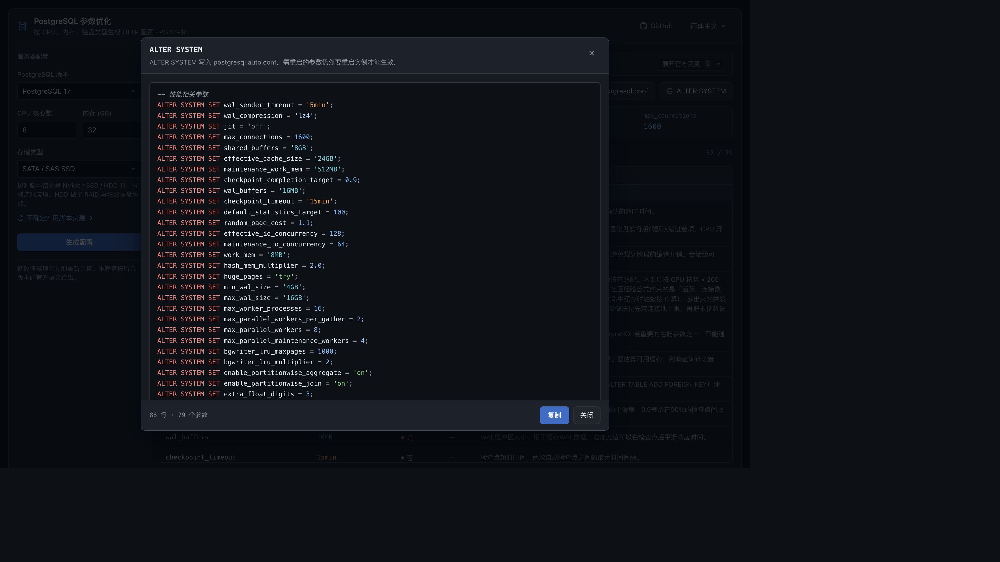
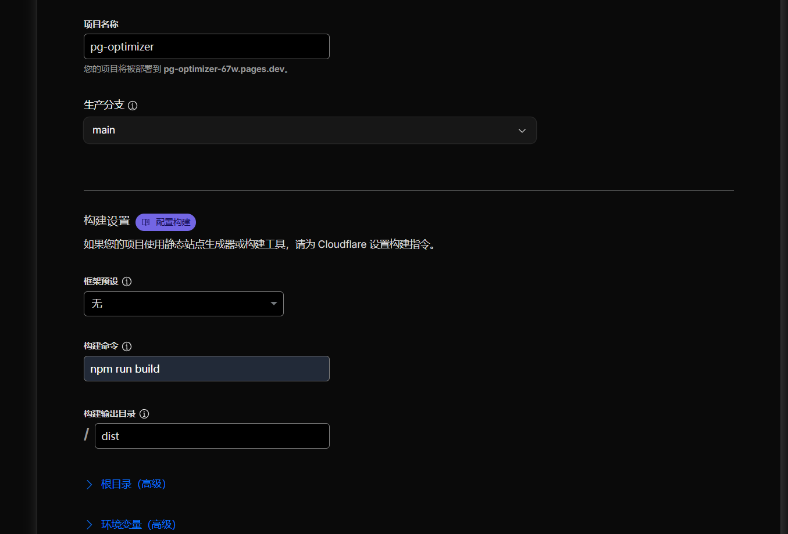

# PostgreSQL 性能参数优化工具

一个基于 Vue 3 的 PostgreSQL 性能参数自动优化工具，根据服务器配置（CPU核心数、内存大小、存储类型）自动生成优化的 PostgreSQL 配置参数。

**官网：<https://pg-optimizer.poiig.top/>** — 无需安装，打开即用。

## 📸 系统运行截图

### 主界面

*左侧填写版本、CPU、内存和存储类型（SSD / NVMe / HDD），右侧即时给出推荐配置*

### 生成的配置参数

*参数按类别筛选，表格含取值、是否需重启、版本徽章和说明，可直接改值*

### 功能演示

*点 postgresql.conf 或 ALTER SYSTEM 会弹窗展示全文，核对后再复制*

## ✨ 功能特性

- 🎯 **智能参数计算**: 根据服务器配置自动计算优化的 PostgreSQL 参数
- 📊 **多版本支持**: 覆盖 PostgreSQL 13–18，13 沿用生产基线公式，14–18 只补充官方新增或语义变化的参数
- 💾 **存储类型优化**: 支持 HDD / SATA·SAS SSD / 本地 NVMe，并按介质调整 I/O 相关参数
- 🔬 **磁盘类型实测**: 附带 `detect_disk_type.sh`，用 fio 压测结果决定该选哪一档
- 📋 **一键复制**: 复制时弹窗展示 postgresql.conf 与 ALTER SYSTEM 全文，可核对后再粘贴
- 🔍 **搜索与筛选**: 按参数名、取值、说明搜索，可按分类或"需重启"过滤
- 📖 **参数说明**: 每个参数都有详细说明和对应版本的官方文档链接
- 🔄 **重启提示**: 明确标识哪些参数需要重启服务才能生效

## 🛠️ 技术栈

- **Vue 3** (Composition API)
- **Vite** (构建工具)
- **原生 CSS** (样式)

## 🚀 一键部署

### 使用 Cloudflare Pages 部署

[](https://dash.cloudflare.com/?to=/:account/workers-and-pages/create/pages)

#### 环境要求
- Node.js 18+
- npm（或 pnpm/yarn，对应修改命令）

#### 1. Fork 本仓库
将此项目 Fork 到你自己的 GitHub 账户下。

#### 2. 创建 Cloudflare Pages 项目
* 登录 Cloudflare 控制台，进入 `Workers & Pages`。
* 选择“创建应用程式” -> “Pages” -> “连结到 Git”。
* 选择你刚刚 Fork 的仓库。
* 在 **“设定组建和部署”** 页面，构建设定如下：
  * **框架预设**: `None`
  * **构建命令**: `npm run build`
  * **构建输出目录**: `dist`  ← 重要，Vite 默认输出目录
  * **环境变量**: 默认无需配置（如需自定义 API，可在此添加）

#### 3. 确认生产分支
默认使用 `main`；如有自定义分支，请在 Pages “来源”里切换。

#### 4. 部署
保存后将自动构建并部署，稍等几分钟即可访问。

#### Pages 配置检查清单
- ✅ 构建命令为 `npm run build`
- ✅ 构建输出目录为 `dist`
- ✅ 生产分支选择正确（默认 `main`）
- ✅ 无需 Workers 绑定或 KV/R2 依赖
- ✅ 需要自定义域名时，记得在 Pages 完成域名绑定和 DNS 生效



### 使用 Docker 部署

```bash
# 构建镜像
docker build -t pg-optimizer .

# 运行容器（默认 80 端口）
docker run -d --name pg-optimizer -p 8080:80 pg-optimizer
```

说明：
- 基于 `nginx:alpine` 托管构建产物，默认监听 80 端口。
- 已包含 `try_files` 回退到 `index.html`，支持前端路由刷新不 404。
- 如需自定义缓存/HTTPS，请替换 `docker/nginx.conf` 后重新构建。

### 使用 Docker Compose 部署

```bash
# 前台启动（默认映射 8080 到容器 80）
docker-compose up

# 后台启动
docker-compose up -d

# 停止并清理
docker-compose down
```

## 📦 本地安装和运行

### 安装依赖

```bash
npm install
```

### 开发模式

```bash
npm run dev
```

应用将在 `http://localhost:3000` 启动（支持通过 IP 地址访问）

### 构建生产版本

```bash
npm run build
```

### 预览生产构建

```bash
npm run preview
```

## 📖 使用方法

1. 选择 PostgreSQL 版本（13–18）
2. 输入 CPU 核心数（例如：8）
3. 输入内存大小（GB，例如：32）
4. 选择存储类型（HDD / SATA·SAS SSD / 本地 NVMe），不确定时用下面的脚本实测
5. 参数会随输入实时重算，也可以点"生成配置"手动触发
6. 需要微调时直接在表格里改参数值，复制出来的内容会同步
7. 点 postgresql.conf 或 ALTER SYSTEM，弹窗展示全文后再复制

## 🔬 磁盘类型实测

云盘的规格页不一定反映真实性能，`effective_io_concurrency`、`random_page_cost` 又依赖存储类型，所以提供了一个压测脚本：

```bash
curl -fsSL https://raw.githubusercontent.com/Poiig/pg-optimizer/main/detect_disk_type.sh -o detect_disk_type.sh
bash detect_disk_type.sh -d /var/lib/postgresql/data
```

脚本跑 4KB 随机读，按 IOPS 和延迟分位数判定 HDD / SSD / NVMe，再在页面里选对应项。

| 选项 | 说明 |
| --- | --- |
| `-d DIR` | 测试目录，指到 PGDATA 所在的盘才准（默认当前目录） |
| `-s SIZE` | 测试文件大小，默认 `4G`，空间不够用 `-s 1G` |
| `-t SEC` | 压测时长，默认 20 秒 |
| `--no-install` | 不自动装依赖，只打印需要执行的安装命令 |
| `-y` | 自动安装依赖时不再询问 |

依赖方面：压测本身需要 `fio`；解析结果会在 `jq`、`python3`、`awk` 之间挑一个可用的，所以没装 `jq` 也能跑完。有 root 或免密 sudo 时脚本会询问是否自动安装，没有权限就用 `--no-install` 拿到手动安装命令。测试文件跑完自动删除，文件系统不支持 `O_DIRECT`（overlayfs、tmpfs）时会降级为带缓存读并在结论里标注。

## 🔢 参数算法说明

工具根据以下算法自动计算 PostgreSQL 性能参数。内存相关计算均以用户输入的内存（GB）换算为字节后进行。

### 基础计算

- **DBInstanceClassMemory** = 内存(GB) × 1024³（字节）

### 核心性能参数

#### 1. max_connections
```
max_connections = CPU核心数 × 200
```
按核数给出上限，可酌情减少；多余并发宜放在连接池。

#### 2. shared_buffers
```
shared_buffers = DBInstanceClassMemory / 4
```
内存的 1/4，用于缓存数据页。

#### 3. effective_cache_size
```
effective_cache_size = DBInstanceClassMemory × 3 / 4
```
规划器估算可用 OS 缓存；32GB 内存时为 24GB。

#### 4. work_mem
```
work_mem = GREATEST(DBInstanceClassMemory / 4194304, 4096)   # KB
```
单操作排序/哈希内存；32GB 时为 8MB。

#### 5. hash_mem_multiplier
```
hash_mem_multiplier = 2.0
```
哈希表可用 `work_mem × 2`（全版本推荐；官方默认到 PG15 才改为 2.0）。

#### 6. maintenance_work_mem
```
maintenance_work_mem = LEAST(DBInstanceClassMemory / 65536, 4194304)   # KB
```
VACUUM / CREATE INDEX 等；32GB 时为 512MB，上限 4GB。

#### 7. wal_buffers
```
wal_buffers = min(shared_buffers / 32, 16MB)
```
官方自动值约为 `shared_buffers/32`，超过一个 WAL 段（通常 16MB）几乎无收益，故封顶 16MB。

#### 8. min_wal_size / max_wal_size
```
min_wal_size = LEAST(GREATEST(DBInstanceClassMemory / 8388608, 256), 8192)   # MB
max_wal_size = LEAST(GREATEST(DBInstanceClassMemory / 2097152, 2048), 16384) # MB
```
随内存放大，分别上限 8GB / 16GB。

#### 9. temp_file_limit
```
temp_file_limit = DBInstanceClassMemory / 1024   # KB（即等于物理内存）
```
单会话临时文件上限。

### 并行处理参数（仅 CPU ≥ 4 核时输出）

```
max_worker_processes              = CPU × 2
max_parallel_workers_per_gather   = PG13: max(CPU/2, 2)；PG14+: 2
max_parallel_workers              = max(CPU×3/4, 8)；PG14+ 不超过 max_worker_processes
max_parallel_maintenance_workers  = max(CPU/2, 2)
```
4 核以下交给官方默认，避免小机并行过猛。

### 自动清理参数

```
autovacuum_vacuum_scale_factor / analyze_scale_factor = 0.05
autovacuum_naptime                                  = 15s
autovacuum_vacuum_cost_delay                        = 2ms
autovacuum_vacuum_cost_limit                        = max_workers × 200
vacuum_freeze_table_age / multixact_freeze_table_age = 150000000
```

workers：
```
# 内存档：每满 16GB 计 1
workersByMemory = floor(DBInstanceClassMemory / 16GB)
# PG13：只按内存，下限 3、上限 10
# PG14+：再与 CPU/2 取大，下限 3、上限 10
autovacuum_vacuum_cost_limit 随 workers 放大，满员时每人约等于官方默认 200
```

```
autovacuum_work_mem = min(max(DBInstanceClassMemory/65536, 131072), 1048576)  # KB，帽 1GB
```
PG18 另给 `autovacuum_worker_slots`（≥16）与 `autovacuum_vacuum_max_threshold=50000000`。

### I/O 相关参数（按存储类型）

| 存储 | random_page_cost | effective_io_concurrency | maintenance_io_concurrency |
| --- | --- | --- | --- |
| HDD 单盘 | 4 | 2 | 2 |
| HDD RAID | 4 | 数据盘块数 | 数据盘块数 |
| SATA/SAS SSD | 1.1 | 128 | 64 |
| 本地 NVMe | 1.1 | 200 | 64 |

不确定盘型时可用仓库内 `detect_disk_type.sh` 实测。

### 其他常用固定/版本相关值

- **checkpoint_timeout** `15min`，**checkpoint_completion_target** `0.9`
- **bgwriter_lru_maxpages** `1000`，**bgwriter_lru_multiplier** `2`
- **wal_compression**：PG13/14 为 `on`（pglz）；PG15+ 为 `lz4`
- **jit** `off`（短 OLTP 查询通常更合适）
- **log_min_duration_statement** `5000ms`；**log_temp_files** `10MB`
- **log_min_duration_sample** `500ms` + **log_statement_sample_rate** `0.2`（PG13 起官方就有，低于慢查询阈值的语句按比例采样）

### 智能单位选择

内存类参数优先显示为整数 GB / MB，否则用 kB。例如 32GB 规格下：`shared_buffers=8GB`，`wal_buffers=16MB`，`work_mem=8MB`。
## 📝 参数分组

生成的参数按以下类别分组：

1. **性能相关参数**: 核心性能参数，如 shared_buffers、work_mem、并行处理参数等
2. **自动清理相关配置**: autovacuum 和 vacuum 相关参数
3. **超时相关**: 连接和语句超时参数
4. **日志记录相关**: 日志配置参数
5. **其他参数**: 其他优化参数

## 🔄 参数重启要求

表格「重启」列按官方 GUC context 标注：只有 `postmaster`（文档写 *can only be set at server start*）才标「是」。

本工具会输出且需要重启的参数：

- **全版本**：`shared_buffers`、`wal_buffers`、`max_connections`、`huge_pages`、`max_worker_processes`、`logging_collector`、`autovacuum_freeze_max_age`、`autovacuum_multixact_freeze_max_age`
- **PG13–17**：`autovacuum_max_workers`
- **PG18**：改为 `autovacuum_worker_slots` 需重启；`autovacuum_max_workers` 只要槽位够，`pg_reload_conf()` 即可

其余推荐项（含 `jit`、并行度、autovacuum 阈值/配额、checkpoint、日志级别）都是 SIGHUP 或会话级，reload 或 `SET` 即可，不必重启。

## 📚 参数说明

每个参数都包含：
- **详细说明**: 参数的作用和用途
- **官方文档链接**: 点击参数名旁边的链接图标可查看 PostgreSQL 官方文档
- **悬停提示**: 鼠标悬停在"?"图标上可查看参数说明

## 🎯 使用建议

1. **首次使用**: 建议先在测试环境验证生成的参数
2. **参数调整**: 可以根据实际业务需求手动调整参数值
3. **重启参数**: 修改需要重启的参数后，需要重启 PostgreSQL 服务
4. **监控调整**: 使用生成的参数后，建议监控数据库性能，根据实际情况调整

## 📄 许可证

MIT License

## 🤝 贡献

欢迎提交 Issue 和 Pull Request！

## 🌐 在线演示

官网（Cloudflare Pages 部署）：<https://pg-optimizer.poiig.top/>

纯前端计算，不上传任何服务器信息，也不需要连接数据库。

## 📞 联系方式

如有问题或建议，请提交 Issue。
